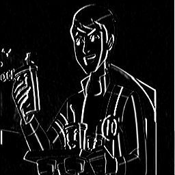

# GPU-Accelerated Image Edge Detection with TensorFlow

A hands-on capstone project that demonstrates how a **GPU** can dramatically accelerate classical image-processing operations. The project takes a standard input image, applies a **Sobel edge-detection filter** through a 2D convolution, and runs the entire pipeline on an NVIDIA GPU using **TensorFlow** in **Google Colab**.

The goal is not just to detect edges — it is to show, end-to-end, *why* GPUs are the right hardware for convolution-heavy workloads, *how* TensorFlow exposes that hardware to a Python program, and *how* to verify that the work actually executed on the GPU rather than silently falling back to the CPU.

---

## Table of Contents
1. [Overview](#-overview)
2. [Why GPUs for Edge Detection?](#-why-gpus-for-edge-detection)
3. [How It Works](#-how-it-works)
4. [The Sobel Operator](#-the-sobel-operator)
5. [Tools & Technologies](#%EF%B8%8F-tools--technologies)
6. [Project Structure](#-project-structure)
7. [How to Run (Google Colab)](#-how-to-run-google-colab)
8. [How to Run (Local GPU)](#-how-to-run-local-gpu)
9. [Visual Results](#%EF%B8%8F-visual-results)
10. [GPU Verification](#-gpu-verification)
11. [Performance Notes](#-performance-notes)
12. [Troubleshooting](#-troubleshooting)
13. [Lessons Learned](#-lessons-learned)
14. [Presentation](#-presentation)
15. [Conclusion](#-conclusion)

---

## 🔍 Overview

This project demonstrates GPU-accelerated image processing using TensorFlow inside Google Colab. It:

- Loads a sample image (a Ben 10 / Ben Tennyson cartoon frame).
- Converts it to grayscale and resizes it for predictable performance.
- Applies a **Sobel horizontal edge-detection kernel** via `tf.nn.conv2d()`.
- Forces the convolution onto the GPU using a `with tf.device('/GPU:0')` block.
- Saves the output image and writes a verification log to disk.
- Visualizes the original and edge-detected images side-by-side.

It serves as a *minimal but complete* example of a GPU-accelerated TensorFlow program — small enough to read in one sitting, but realistic enough to map cleanly onto larger CNN-style workloads.

---

## ⚡ Why GPUs for Edge Detection?

Edge detection on a single small image is fast on any modern CPU — so why bother with a GPU?

The answer is that **edge detection is a convolution**, and convolutions are the canonical workload that GPUs were redesigned around in the deep-learning era:

- **Massively parallel**: every output pixel is independent and can be computed in parallel. A GPU has thousands of cores; a CPU has a handful.
- **Regular memory access**: convolution kernels touch a small, predictable neighborhood of pixels — perfect for the GPU's memory hierarchy.
- **Throughput-bound, not latency-bound**: GPUs win when you can amortize launch cost over a large amount of work — high-resolution images, batches of images, video frames, or stacked filters.

This project intentionally uses a *simple* operator (Sobel) so that the GPU plumbing — device placement, kernel definition, tensor shapes, verification — is the focus, not the math. The same pipeline scales directly to larger kernels, multi-channel filters, batched inputs, and full convolutional neural networks.

---

## 🧠 How It Works

The pipeline, end-to-end:

1. **Load the image** with PIL, convert it to grayscale (`L` mode), and resize it for consistent benchmarking.
2. **Reshape to a TensorFlow tensor** of shape `[1, H, W, 1]` — the `[batch, height, width, channels]` layout `tf.nn.conv2d` expects.
3. **Define the Sobel-X kernel** as a `[3, 3, 1, 1]` tensor — `[kernel_h, kernel_w, in_channels, out_channels]`.
4. **Run the convolution on the GPU**, scoped by `with tf.device('/GPU:0')`, with `strides=[1, 1, 1, 1]` and `padding='SAME'` so the output has the same spatial dimensions as the input.
5. **Post-process** the output: take the absolute value, clip to `[0, 255]`, cast to `uint8`.
6. **Save** the result as `gpu_output_tf.png` and **display** it inline using Matplotlib.
7. **Verify** GPU execution by listing physical devices and writing the result to `log.txt`.

---

## 🧮 The Sobel Operator

Sobel is one of the oldest and most reliable edge-detection kernels. It approximates the **gradient** of image intensity in a given direction. This project uses the **horizontal gradient** kernel `Gx`:

```
Gx =  [[-1,  0,  1],
       [-2,  0,  2],
       [-1,  0,  1]]
```

Intuition:
- The kernel slides over the image. At every position it computes a weighted sum of the 3×3 neighborhood.
- Pixels where intensity changes sharply *from left to right* produce large positive or negative responses.
- Flat regions (sky, walls, solid colors) cancel out to roughly zero.

Pairing `Gx` with a vertical counterpart `Gy` and combining them via `sqrt(Gx² + Gy²)` gives full-direction edge strength — a natural extension if you want to take this project further.

---

## ⚙️ Tools & Technologies

| Component | Version / Notes |
|---|---|
| Google Colab | GPU runtime — Tesla **T4** (default free-tier GPU) |
| TensorFlow | 2.18.0 |
| Python | 3.11 |
| NumPy | bundled with TensorFlow |
| Pillow (PIL) | image loading and saving |
| Matplotlib | inline visualization |
| CUDA / cuDNN | provided by Colab — no manual install required |

---

## 📂 Project Structure

| File | Description |
|---|---|
| `edge_detection_gpu_tensorflow.ipynb.ipynb` | Main Colab notebook containing the full pipeline. |
| `Ben Tennyson.jpg` | Input image used for the demonstration. |
| `gpu_output_tf.png` | Output image produced by the GPU-based Sobel filter. |
| `log.txt` | Text log confirming the GPU device that ran the convolution. |
| `Presentation.pptx` | Slide deck used in the project walkthrough. |
| `README.md` | This file. |

---

## 🚀 How to Run (Google Colab)

1. Open the notebook `edge_detection_gpu_tensorflow.ipynb.ipynb` in Google Colab.
2. Switch the runtime to a GPU: **Runtime → Change runtime type → Hardware accelerator → GPU (T4)**.
3. (Optional) Upload your own `.jpg` or `.png` image — any grayscale-friendly image works. The notebook ships with the Ben 10 example.
4. Run all cells (**Runtime → Run all**).
5. Inspect the inline plot showing the original vs. edge-detected image.
6. Confirm that `gpu_output_tf.png` and `log.txt` appear in the file browser on the left.

---

## 💻 How to Run (Local GPU)

If you prefer running locally with a CUDA-capable NVIDIA GPU:

```bash
# 1. Create a clean environment
python -m venv .venv
source .venv/bin/activate          # Windows: .venv\Scripts\activate

# 2. Install dependencies
pip install --upgrade pip
pip install "tensorflow[and-cuda]==2.18.0" pillow matplotlib jupyter

# 3. Verify GPU visibility
python -c "import tensorflow as tf; print(tf.config.list_physical_devices('GPU'))"

# 4. Launch Jupyter and open the notebook
jupyter notebook
```

If TensorFlow does not detect your GPU, see the [Troubleshooting](#-troubleshooting) section.

---

## 🖼️ Visual Results

| Original Image | Edge Detection (GPU Output) |
|---|---|
|  |  |

The output highlights vertical contours (silhouette edges, character outlines, hair strands) where horizontal intensity changes are strongest — exactly what the Sobel-X kernel is designed to surface.

---

## ✅ GPU Verification

To make sure the convolution actually ran on the GPU and not the CPU, the notebook does two things:

**1. Lists available physical GPUs:**

```python
import tensorflow as tf
tf.config.list_physical_devices('GPU')
# Expected:
# [PhysicalDevice(name='/physical_device:GPU:0', device_type='GPU')]
```

**2. Scopes the convolution explicitly:**

```python
with tf.device('/GPU:0'):
    output = tf.nn.conv2d(image_tensor, sobel_kernel,
                          strides=[1, 1, 1, 1], padding='SAME')
```

A successful run also writes `log.txt` containing the detected device list, which serves as a permanent artifact that GPU execution occurred.

---

## 📊 Performance Notes

For a single 512×512 grayscale image with a 3×3 kernel, the GPU and CPU are both effectively instant — the work is too small to expose a meaningful difference, and the GPU's launch overhead can even make it look slower in isolation.

The GPU advantage shows up when you scale **any** of these dimensions:

- **Image size** — 4K images, microscopy data, satellite tiles.
- **Batch size** — processing many images at once (e.g., a folder, a video).
- **Kernel size** — larger kernels, separable filters, or stacked operators.
- **Channels** — RGB, multi-spectral, or feature maps inside a CNN.

A natural extension to this project is to benchmark CPU vs. GPU across these axes to make the speedup visible. The pipeline is set up so that swapping `'/GPU:0'` for `'/CPU:0'` is a one-line change.

---

## 🛠️ Troubleshooting

**`tf.config.list_physical_devices('GPU')` returns `[]` in Colab.**
The runtime is still on CPU. Go to **Runtime → Change runtime type** and select **GPU**, then re-run all cells (the runtime restarts and resets module state).

**`tf.config.list_physical_devices('GPU')` returns `[]` locally.**
Common causes: TensorFlow installed without CUDA support (`pip install tensorflow` instead of `tensorflow[and-cuda]`), an NVIDIA driver too old for the bundled CUDA version, or a non-NVIDIA GPU. Verify with `nvidia-smi` first; if that fails, the issue is the driver, not TensorFlow.

**`InvalidArgumentError: Conv2DCustomBackpropInputOp ... rank ...`.**
The input tensor is the wrong shape. `tf.nn.conv2d` requires `[batch, H, W, channels]` and the kernel requires `[kH, kW, in_channels, out_channels]` — both must be 4-D, even for a single grayscale image.

**The output image is all black or all white.**
The raw convolution output can be negative or exceed 255. Take `tf.abs(...)` and clip to `[0, 255]` before casting to `uint8`.

**Colab kicks you off the GPU runtime.**
Free-tier GPU access is rate-limited and session-bound. Re-run after the cooldown, or use Colab Pro for longer sessions.

---

## 📚 Lessons Learned

- TensorFlow makes GPU execution almost invisible — which is great for productivity but dangerous for verification. **Always confirm device placement explicitly.**
- Classical operators like Sobel are a clean stepping stone between “I understand convolution mathematically” and “I can build CNNs that run on GPUs.”
- Tensor shapes are by far the most common source of friction. Internalizing the `[batch, H, W, C]` and `[kH, kW, in_C, out_C]` conventions pays off immediately.
- The bottleneck for tiny workloads is *kernel launch overhead*, not compute — a useful intuition for understanding when GPUs help and when they don't.

---

## 🎥 Presentation

**Video walkthrough:** [Google Drive link](https://github.com/MINTU296)

The video covers:
- What the code does, line by line.
- How TensorFlow dispatches the convolution onto the GPU.
- A side-by-side visual comparison of input and output.
- Lessons learned and possible extensions.

---

## 📌 Conclusion

This project fulfills the GPU Specialization Capstone requirement by demonstrating a real, reproducible GPU-accelerated application built on TensorFlow. It is intentionally compact — a single image, a single kernel, a single convolution — but the structure (load → reshape → kernel → GPU-scoped op → verify → save) generalizes directly to batched processing, multi-channel filters, and full convolutional networks.

It is meant to be read, run, and extended.

---

**Author:** Mintu Kumar
